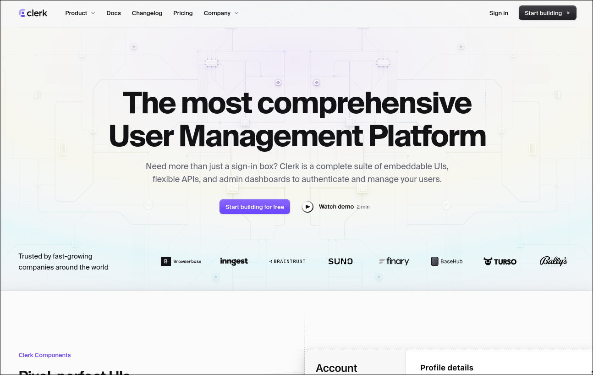
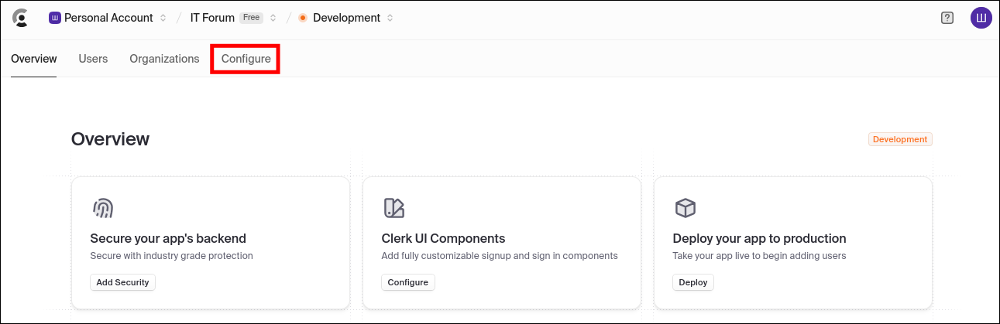
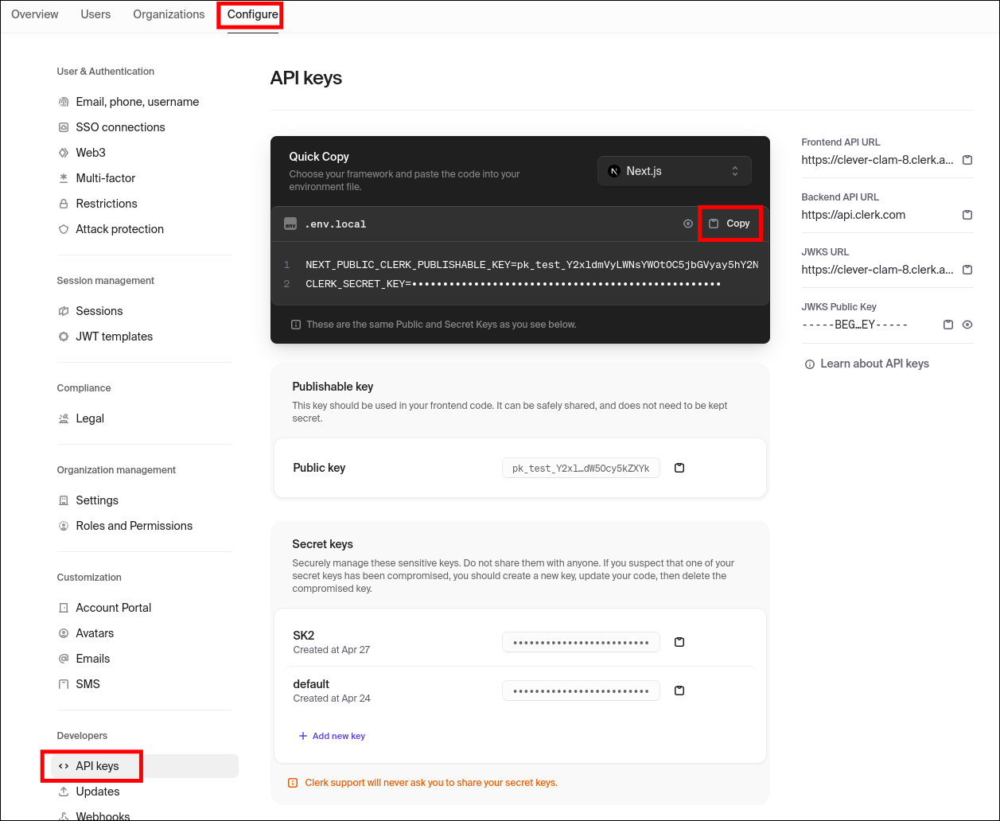

# Як отримати API ключі для Clerk

1. Перейдіть на сайт [Clerk](https://clerk.com/) та увійдіть у свій акаунт або зареєструйтесь.

2. Створіть новий проект (якщо у вас ще немає).
3. Виберіть ваш проект у Dashboard.
4. Перейдіть у розділ **Configure** > **API keys**

5. Скопіюйте:
   - **Publishable Key** (`CLERK_PUBLISHABLE_KEY` або `NEXT_PUBLIC_CLERK_PUBLISHABLE_KEY`)
   - **Secret Key** (`CLERK_SECRET_KEY`)
6. Додайте ці ключі у відповідні `.env` файли бекенду та фронтенду згідно з [налаштування зміних середовища](../docs/setup-and-run-the-project.md#налаштування-змінних-середовища).

> **Увага!** Не публікуйте секретний ключ у відкритому доступі. 