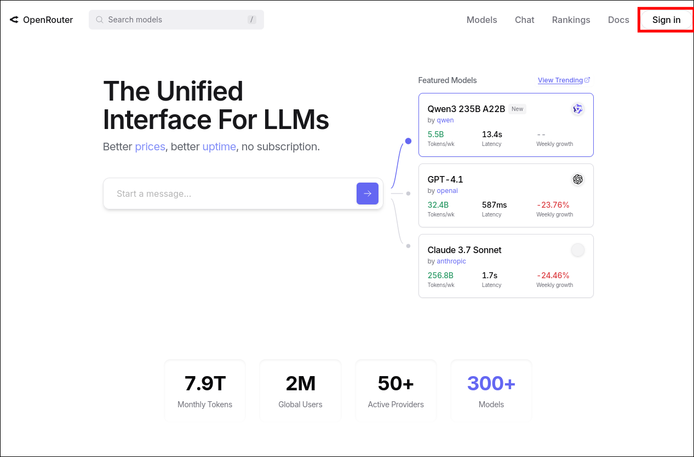
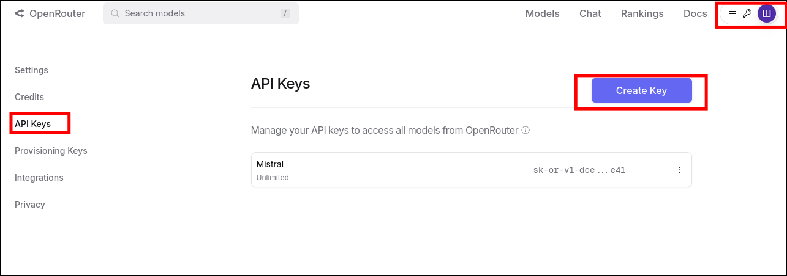

# Як отримати API ключ для OpenRouter

1. Перейдіть на сайт [OpenRouter](https://openrouter.ai/) та увійдіть у свій акаунт або зареєструйтесь.

2. Після входу натисніть на свій профіль (у правому верхньому куті) та виберіть **API Keys**.

3. Натисніть кнопку **Create Key** (Створити новий ключ).
4. Дайте ключу назву (наприклад, "IT Forum") та натисніть **Create**.

5. Скопіюйте згенерований API ключ (`OPENROUTER_API_KEY`).

6. Додайте цей ключ у `.env` файл бекенду згідно з [налаштування зміних середовища](../docs/setup-and-run-the-project.md#налаштування-змінних-середовища).

> **Увага!** Не публікуйте свій API ключ у відкритому доступі. 