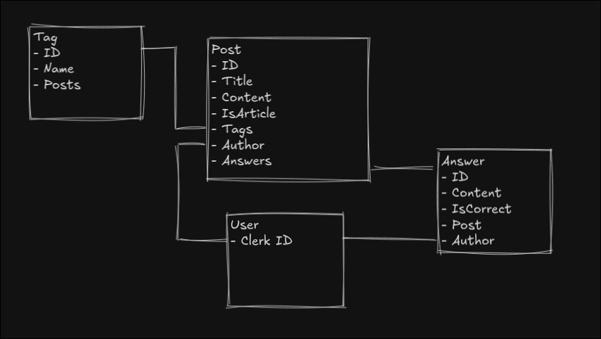
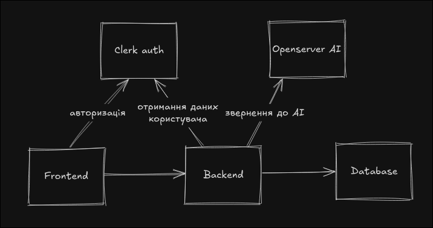

# IT Forum — Інструкція з розгортання

## Опис

Цей проєкт складається з двох частин:
- **Бекенд** — NestJS (TypeScript, Node.js)
- **Фронтенд** — Next.js (React, TypeScript)

### Таблиці в базі даних


*Post - це і стаття і питання в одній таблиці.

### Архітектура



---

## Вимоги
- Node.js >= 18.x
- npm >= 9.x (або yarn/pnpm/bun)
- PostgreSQL (для локального запуску)

---

## Встановлення залежностей

### Бекенд
```bash
cd backend
npm install
```

### Фронтенд
```bash
cd frontend
npm install
```

---

## Налаштування змінних середовища

### Бекенд (`backend/.env`):
```
DATABASE_URL="postgresql://<username>:<password>@localhost:5432/<database>"
OPENROUTER_API_KEY=... (ваш ключ)
CLERK_PUBLISHABLE_KEY=... (ваш ключ)
CLERK_SECRET_KEY=... (ваш ключ)
```

- **DATABASE_URL** — посилання на вашу базу даних PostgreSQL
- **OPENROUTER_API_KEY** — API-ключ для OpenRouter
- **CLERK_PUBLISHABLE_KEY** та **CLERK_SECRET_KEY** — ключі для Clerk (автентифікація)

### Фронтенд (`frontend/.env`):
```
NEXT_PUBLIC_CLERK_PUBLISHABLE_KEY=... (ваш ключ)
CLERK_SECRET_KEY=... (ваш ключ)
NEXT_PUBLIC_API_URL=http://localhost:3001
```
- **NEXT_PUBLIC_CLERK_PUBLISHABLE_KEY** — публічний ключ Clerk
- **CLERK_SECRET_KEY** — секретний ключ Clerk
- **NEXT_PUBLIC_API_URL** — адреса бекенду (за замовчуванням http://localhost:3001)

---

## Запуск проєкту

### Бекенд
```bash
cd backend
npm run start:dev
```
Бекенд буде доступний на http://localhost:3001

### Фронтенд
```bash
cd frontend
npm run dev
```
Фронтенд буде доступний на http://localhost:3000

---

## Корисні посилання
- [NestJS документація](https://docs.nestjs.com/)
- [Next.js документація](https://nextjs.org/docs)
- [Clerk документація](https://clerk.com/docs)
